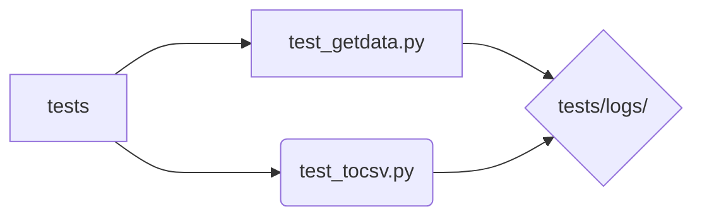

# Bem-vindo ao GetFinance

GetFinance é uma aplicação destinada a entusiastas do mercado financeiro, capturando dados em tempo real diretamente da API do Yahoo Finance, retornando uma planilha **.csv** completa salva com o nome da ação escolhida e seus devidos dados: **time**, **volume**, **low**, **close**, **open**, **high**, baseados no **range** selecionado.

# Primeiros Passos

Inicialmente, é de extrema importância o uso do arquivo **requirements.txt**, por meio do **pip install -r requirements.txt**, assim instalando os pacotes em suas devidas versões usadas no projeto.

> **Nota:** Para os mais familiarizados e que optarem por manter os pacotes em um ambiente venv, pode-se fazer uso do comando **python -m venv getfinance**.

# Funções

## src/get_data.py

 |Função           |Argumentos    |
|------------------|--------------|
|get_stock         |stock, range  

 **get_stock**: captura dados da API do Yahoo Finance, retornando um **json** contendo os dados da **ação**, e o nome da ação. Tendo como os argumentos: **stock** (Ex: "USIM5.SA") e **range** que se trata do intervalo de tempo que busca capturar, sendo eles:
  
  * 1d  - 1 dia.
  * 5d - 5 dias.
  * 1mo - 1 mês.
  * 6mo - 6 meses.
  * ytd - Captura os dados desde o inicio do ano até o dia atual.
  * 1y - 1 ano.

## src/to_csv.py
|Função        |Argumentos    |
|--------------|--------------|
|to_csv        |data  

**to_csv**: Utiliza os dados capturados da função **get_stock** para gerar um dataframe, convertendo os dados "**timestamp**" para o formato de data convencional,  exportando para um arquivo **.csv** com o nome da ação e a data e hora em que foi gerado em uma pasta possuindo o mesmo nome da ação, localizada em **historical_data** (Que é criada automaticamente caso não exista). Sendo os argumentos:

* data: Uma **lista** com dois itens, um **json** com os dados para serem utilizados, e o nome da ação (**str**).

## main.py
|Função        |Argumentos    |
|--------------|--------------|
|main          |stock, range

**main**: Utiliza **get_stock** e **to_csv** para gerar um arquivo **.csv** com o nome da ação e a data e hora em que foi gerado. Os argumentos utilizados são os mesmos inseridos para a função **get_stock**, sendo eles:
  * 1d  - 1 dia.
  * 5d - 5 dias.
  * 1mo - 1 mês.
  * 6mo - 6 meses.
  * ytd - Captura os dados desde o inicio do ano até o dia atual.
  * 1y - 1 ano.

# Testes
## tests/test_getdata.py
Executa testes para o arquivo **src/get_data.py**, criando a pasta **tests/logs** para consulta dos resultados, na qual são salvos em um arquivo **.txt**, os seguintes testes são feitos:
- **AttributeError**: Verifica se retorna um erro ao inserir argumentos que não sejam do tipo **str**.
- **Tipo de Retorno**: Verifica se está realmente retornando os dados no tipo correto, **dict** e **str**.

## tests/test_to_csv.py
Executa testes para o arquivo **src/to_csv.py**, criando a pasta **tests/logs** para consulta dos resultados, na qual são salvos em um arquivo **.txt**, os seguintes testes são feitos:
- **AttributeError**: Verifica se retorna um erro ao inserir argumentos que não sejam do tipo **str**.

## Fluxograma:

Localizados no diretório **tests**, todos os arquivos de teste são executados e seus resultados (logs) são registrados e salvos em um arquivo **.txt** para consulta em **tests/logs/**.